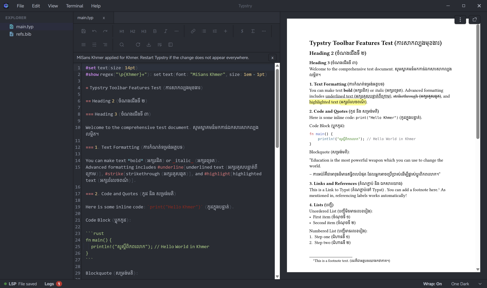

# Typstry - A Unicode-Aligned Typst Editor

<p align="center">
  
</p>

A lightweight, local-first Typst editor with seamless Code and WYSIWYM toggles, advanced Unicode font fallbacks, and real-time Tinymist LSP previews. Built with Tauri, Bun, and CodeMirror 6.

## Screenshots

<p align="center">
  
  <br/><br/>
  
  <br/><br/>
  
</p>

## Key Features
* **Unicode-First Philosophy**: Traditional code editors treat complex non-Latin scripts as an afterthought. Typstry is engineered from the ground up to perfectly render and align Unicode text, ensuring seamless co-existence of code and complex scripts (like Khmer, Arabic, and Thai) without breaking cursor alignment or word-wrap.
* **Rich IDE-Grade Autocompletion**: Smart, context-aware suggestions with LSP `sortText` prioritization (which correctly places specific parameters like `numbering` or `supplement` at the top of the list). Intelligently blocks autocomplete from triggering on brackets, punctuation, or spaces to ensure a distraction-free typing flow.
* **True Local-First Experience**: No cloud dependencies. Everything compiles instantly on your local machine.
* **Live PDF Preview**: Powered by the highly optimized Tinymist LSP running in a Rust background process with bidirectional scroll sync.
* **Focus-Driven UI**: A custom, frameless window design, persistent multi-tab workspace state (preserving open tabs, split ratios, and cursor positions), and integrated native-feel search and replace.
* **Native Settings System**: A compact settings panel with live editor reconfiguration and a versioned `settings.json` stored in the platform application-config directory.
* **Context-Aware Editor & Bracket Colorizer**: Implements intelligent syntax recognition, skipping bracket coloring inside comments, strings, and equations. Integrates theme-aware monospace coloring for raw code/equations, nested function coloring without requiring `#` prefixes, and precise parsing of escaped symbols (like `\$` for literal dollars and ignoring URL comments).
* **Blazing Fast**: Built on Tauri v2 and Bun, resulting in a tiny memory footprint compared to Electron-based editors.

## Keyboard Shortcuts
* `Ctrl + N`: New File
* `Ctrl + K`, `Ctrl + O`: Open Workspace
* `Ctrl + B`: Toggle Explorer Sidebar
* `Ctrl + M`: Switch Layout (Code vs WYSIWYM)
* `Ctrl + ,`: Open Settings
* `Alt + Z`: Toggle Word Wrap
* `Ctrl + ` `: Toggle Log Console

## Settings

Open Settings from **File → Settings**, the status bar, or `Ctrl + ,`. Changes apply immediately and are persisted to `settings.json`; the panel displays the exact platform-specific file path and can reveal it in the system file manager.

```json
{
  "version": 1,
  "appearance": {
    "theme": "default",
    "editorFontSize": 14,
    "editorLineHeight": 1.7
  },
  "editor": {
    "codeFont": "fira-mono",
    "unicodeFont": "auto",
    "wordWrap": true,
    "tabSize": 2,
    "lineNumbers": true,
    "highlightActiveLine": true,
    "autoCloseBrackets": true,
    "indentationGuides": true
  },
  "preview": {
    "cursorSync": true,
    "syncDebounceMs": 120,
    "highlightDurationMs": 2200
  }
}
```

Invalid or missing fields fall back to bounded defaults. Existing theme and word-wrap values from older releases are migrated from `localStorage` the first time the settings file is created.

MiSans Latin is bundled as the application UI font. Fira Mono Regular/Bold is bundled as the default code font; the code-font selector only lists monospace families registered by the font engine. Unicode fallback is configured separately as automatic detection, no fallback, or a detector-managed font.

## Tech Stack & Architecture
* **Core Framework**: [Tauri v2](https://v2.tauri.app/)
* **Backend (`src-tauri/`)**: Rust (Handles window configuration, system file I/O, and LSP lifecycle management)
* **Frontend Runtime (`src/`)**: Bun + Vite (TypeScript + Vanilla DOM logic with zero-React overhead)
* **Editor Component**: CodeMirror 6

## Getting Started

### Prerequisites

To run and build Typstry locally, you will need the following installed:
- [Rust](https://www.rust-lang.org/tools/install) (for the Tauri backend)
- [Bun](https://bun.sh/) (as the lightning-fast JS package manager and runtime)
- [Node.js](https://nodejs.org/) (for Vite/TS tooling compatibility)

### Installation

1. **Clone the repository**
   ```bash
   git clone https://github.com/Sovichea/typstry.git
   cd typstry
   ```

2. **Install dependencies**
   ```bash
   bun install
   ```

3. **Run in Development Mode**
   This will spin up the Vite frontend and compile the Rust backend.
   ```bash
   bun run tauri dev
   ```

### Building for Production

To compile a highly-optimized, standalone native executable for your operating system:
```bash
bun run tauri build
```
The compiled binaries will be placed in `src-tauri/target/release/`.

## TODO / Roadmap

- [x] Basic UI layout (Sidebar, Code Editor, Preview Pane)
  - [x] Code Editor pane integration
  - [x] Live Preview pane layout
  - [x] Sidebar layout for tools and file explorer
- [x] Integrate Tinymist LSP for real-time preview and diagnostics
  - [x] Rust-based background process management for stable preview server
  - [x] Forward-sync functionality between code editor and preview
  - [x] Cross-zoom-level scrolling synchronization
- [x] Custom Titlebar & Menu system
  - [x] Frameless window design
  - [x] Native-feel titlebar controls
- [x] Welcome screen & Recent projects cache
  - [x] Hide editor panes when no file is active
  - [x] Automate transition from welcome screen to workspace
- [x] Dynamic file explorer with Material icons
  - [x] Material icon integration
  - [x] Custom Rust backend commands for secure file operations (create, rename, copy)
- [ ] Implement robust WYSIWYM (What You See Is What You Mean) layout parsing
  - [x] Intelligent toggle-formatting logic for inline editing
  - [x] DOM-to-markup serialization pipeline
  - [x] Hide technical syntax markers during active editing
  - [ ] Block-level element parsing and visual rendering
- [x] Persistent workspace state (tabs, cursor position, split ratios)
  - [x] Multi-tab support for editing multiple files simultaneously
  - [x] Show welcome screen on app startup, loading workspace state only when opening a recent project
  - [x] Remember open files and cursor positions across sessions
  - [x] Persistent split ratios
  - [x] Save status indicator tracking unsaved changes
- [x] Visual Toolbar for inserting Typst math symbols, fractions, and code snippets
  - [x] UI implementation for visual toolbar
  - [x] Logic to insert symbols and markup correctly
- [ ] Global project-wide search (`Ctrl+Shift+F`)
  - [ ] Search interface and UI
  - [ ] Result navigation and highlighting
- [ ] Advanced Git integration
  - [ ] Status indicators in file explorer
  - [ ] Inline diff viewing
  - [ ] Commit, push, and pull UI
- [x] Snippets and custom auto-complete
  - [x] Context-aware snippets for Typst
  - [x] Auto-complete UI integration
- [x] Context-aware syntax highlighting & editor enhancements
  - [x] Theme-aware unified styling for equations and code blocks
  - [x] Bracket colorizer exclusions (ignores comments, strings, and monospace)
  - [x] Nested function/identifier highlighting without `#` in code mode
  - [x] Escaped character handling (correctly parses `\$` as literal and prevents false comment/reference triggers)
  - [x] Escaped symbol auto-closing prevention
- [x] Settings panel / configuration file (`settings.json`)
  - [x] UI for appearance, editor, and preview preferences
  - [x] Native persistent settings storage and legacy preference migration
- [ ] Integrate Khmer word segmentation engine for accurate text highlighting and selection in the preview pane
  - [ ] Research and integrate WASM segmentation engine
  - [ ] Hook engine into preview highlight logic
- [ ] Embed an AI Copilot / Agent for context-aware Typst auto-completion and document drafting
  - [ ] API integration for language model
  - [ ] Inline UI for code suggestions
- [ ] Establish cross-compilation CI/CD pipelines and verify Tauri builds for Linux and macOS
  - [ ] GitHub Actions workflow for automated builds
  - [ ] Verify and fix Linux builds
  - [ ] Verify and fix macOS builds
- [ ] Interactive Document Outline (Table of Contents) sidebar for quick navigation
  - [ ] Parse document headers via LSP
  - [ ] Outline UI sidebar
- [ ] Integrated Typst Package Manager UI
  - [ ] Package search and discovery interface
  - [ ] Package installation and update handling
