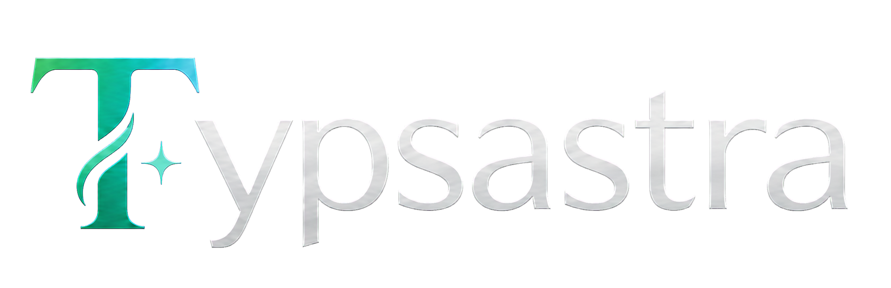
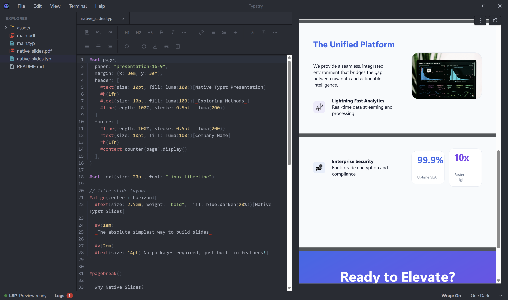
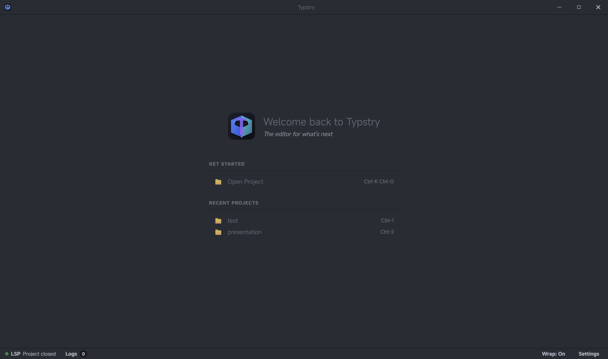

# Typsastra

> A complex-script-first Typst environment for research and long-form multilingual writing.

## Download Typsastra

Typsastra has pre-built desktop releases.

[Download the latest release](https://github.com/Sovichea/typsastra/releases/latest)

Available packages:

- Windows: `.msi`
- Linux: `.AppImage` and `.deb`
- macOS: experimental, unsigned and unnotarized build

Typsastra is currently beta software. The latest release is v0.5.1.

Typsastra is an open-source project and does not plan to purchase Apple
Developer ID signing or notarization. On macOS, Gatekeeper may therefore report
the experimental build as damaged. Download it only from the official release
page, then follow the narrowly scoped workaround in the
[installation guide](./docs/INSTALL.md#open-an-unsigned-macos-release).
Do not disable Gatekeeper globally.

[](https://github.com/Sovichea/typsastra/releases)
[](./LICENSE)
[](https://tauri.app/)

<p align="center">
  
</p>

## What is Typsastra?

Typsastra is a local-first writing environment for Typst, designed for research papers, technical documentation, theses, books, and other long-form documents.

It serves writers and researchers whose languages are not always well supported by traditional technical-writing tools. Typsastra focuses on Unicode-safe editing, script-aware interaction, responsive PDF preview, extensible language tools, and multi-file project workflows while keeping the underlying Typst source portable.

Khmer is the first language with deep support, including tailored cursor and deletion behavior, spellcheck, and word completion. Khmer demonstrates the depth Typsastra aims to provide; it is not the boundary of the project. The editing-policy and language-provider architecture is designed so other languages can add their own behavior without changing or weakening Khmer support.

## Screenshots

<!--
Recommended capture list:

1. Replace or update ./assets/screenshot-editor.png with a multi-file research project, editor, and docked PDF preview.
2. Add ./assets/demo-live-preview.gif showing an included chapter updating the shared full-document preview.
3. Add ./assets/demo-khmer-script-editing.gif showing Khmer cursor movement, deletion, completion, and spellcheck.
4. Add ./assets/screenshot-language-settings.png showing support levels, separate spellcheck and typing-suggestion controls, and downloadable dictionaries.
5. Add ./assets/screenshot-project-workflow.png showing main.typ, templates, chapters, bibliography, and figures in one workspace.

Keep images around 1600px wide or smaller so GitHub README loading stays reasonable.
-->

### Editor and document preview

<p align="center">
  
</p>

<!-- TODO: Add an animated multi-file preview demo.
<p align="center">
  
</p>
-->

### Khmer script-aware editing and language tools

<p align="center">
  
</p>

<!-- TODO: Add the Khmer script-aware editing demo.
<p align="center">
  
</p>
-->

### Project workspace

<p align="center">
  
</p>

<!-- TODO: Add project-workflow and language-settings screenshots after their layouts are final.
<p align="center">
  
</p>
<p align="center">
  
</p>
-->

## Why Typsastra?

Most editors treat complex-script support as a font or rendering concern. Reliable authoring also depends on cursor boundaries, deletion behavior, IME input, Unicode-safe ranges, language segmentation, completion, search, diagnostics, and consistent source-to-preview navigation.

Typsastra treats these as core editor responsibilities. Script-aware editing policies remain separate from dictionaries and language tools, allowing each language to tailor only the behavior it owns. Khmer is the reference implementation for this architecture.

Typsastra also treats a document as a project rather than an isolated file. A real research document may contain a main file, templates, chapters, includes, bibliography databases, figures, data, and files that can be previewed independently. Typsastra is being designed around that structure while preserving compatibility with the standard Typst ecosystem.

## Highlights

- Local-first desktop authoring with ordinary, portable Typst source files.
- CodeMirror editing with Unicode-safe ranges and complex-script font fallback.
- Script-aware editing-policy registry with deeply tailored Khmer behavior.
- Khmer spellcheck and word completion through the pinned Khmer segmenter.
- Lao language support with ICU4X word segmentation and optional `lo_LA` Hunspell dictionary.
- English spellcheck bundled by default, with optional Hunspell-compatible dictionaries for additional languages.
- Independent controls for script-aware editing, spellcheck, and typing suggestions.
- Document-script language routing: each configured script can select one spellcheck and word-completion provider, with no keyboard or same-script guessing.
- Tinymist diagnostics and managed Typst tooling.
- Hardware-accelerated, virtualized PDF preview designed for responsive long-document scrolling and constrained memory use.
- Direct in-app PDF viewing with editable current-page navigation.
- Main-document preview workflows for multi-file projects.
- Explicit source-to-preview navigation through the preview toolbar or keyboard shortcut.
- Portable `.typsastra` workspace state, lazy restored tabs, and confirmation before loading large files.
- Searchable recent-project history, signed update detection, and explicit Tinymist lifecycle management.
- Workspace support for templates, chapters, includes, bibliography files, figures, and external assets.
- Contributor framework for adding new complex-script languages without modifying core editor code.

## Language support

Language support is capability-based rather than all-or-nothing:

- **Deep support** includes a script editing policy, reliable segmentation, spellcheck, and word completion. Khmer is the first and reference deep implementation.
- **Enhanced support** adds a tokenizer or language-specific boundary logic without requiring custom editor behavior. Lao uses ICU4X word segmentation at this level.
- **Basic support** uses a compatible Hunspell dictionary where available. This can provide useful spellcheck, but it is not presented as reliable segmentation for languages that require a dedicated tokenizer.

Each language entry in Settings shows its support level, stability status, and which capabilities are actually available. The long-term goal is for contributors to add a language through explicit policy and provider modules without modifying generic CodeMirror integration or another language's implementation.

## Research-document workflow

Typsastra is designed around one project identity and one configured main document. Opening an included chapter keeps the full-document preview, scroll context, and source relationships intact instead of treating every active file as a separate document.

The scalable workflow covers:

- project and main-document identity;
- included chapters, templates, imports, bibliographies, figures, and data;
- debounced render-on-type for responsive short-document iteration and
  render-on-save for long or resource-intensive documents;
- revision-safe diagnostics, language analysis, compilation, and source navigation;
- virtualized preview rendering for long PDFs;
- workspace restoration and recovery after compiler or LSP failures.

The detailed architecture and trackable work are recorded in the [complex-script-first implementation plan](./docs/COMPLEX_SCRIPT_FIRST_IMPLEMENTATION_PLAN.md).

## Preview synchronization

Typsastra keeps one live preview pinned to the configured main document, including
while editing files imported or included by that document.

Forward sync is currently a manual action so ordinary cursor movement and tab
switching never move the preview unexpectedly. To reveal the editor cursor in
the preview, use the **Reveal Cursor in Preview** button in the preview toolbar,
or press:

- Windows and Linux: `Alt+Enter`
- macOS: `Option+Enter`

Tinymist currently resolves this action to the correct PDF page and source line,
with the preview ripple appearing at the beginning of that line. Exact horizontal
cursor positioning within the line is not currently supported. Typsastra does
not attempt to infer it by matching extracted PDF text because that can produce
incorrect results for repeated text, generated content, mixed scripts, and
complex scripts such as Khmer.

See [PDF preview and source synchronization](./docs/PREVIEW_INTERCEPTION.md) for
the implementation details and current limitations.

## Quick start

1. Download the latest installer from [Releases](https://github.com/Sovichea/typsastra/releases/latest).
2. Install and open Typsastra.
3. Open a Typst workspace or use an included example from the welcome screen.
4. Configure fonts, language tools, preview behavior, and the managed Tinymist toolchain in Settings.

Typsastra downloads and manages Tinymist for preview and diagnostics. A separate Typst installation is not required for normal use.

## Documentation

- [Documentation and tutorial index](./docs/README.md)
- [Getting started](./docs/tutorials/GETTING_STARTED.md)
- [Projects and main files](./docs/tutorials/PROJECTS_AND_MAIN_FILES.md)
- [Multilingual spellcheck](./docs/tutorials/MULTILINGUAL_SPELLCHECK.md)
- [Document typography](./docs/tutorials/DOCUMENT_TYPOGRAPHY.md)
- [Long-document workflow](./docs/tutorials/LONG_DOCUMENT_WORKFLOW.md)
- [PDF preview and source synchronization](./docs/tutorials/PDF_PREVIEW_AND_SYNC.md)
- [Roadmap](./docs/ROADMAP.md)
- [Troubleshooting](./docs/TROUBLESHOOTING.md)
- [Typsastra v0.5.1 release notes](./docs/RELEASE_NOTES_V0.5.1.md)

## Contributing a language

Typsastra has a documented contributor framework for adding new complex-script languages. A contributor can implement a new language by following the guide without editing any generic CodeMirror integration or Khmer code.

The process at a glance:

1. Choose a support tier (Basic, Enhanced, or Deep) based on available data and segmentation.
2. Implement a Rust `LanguageSegmenter` using the annotated provider template.
3. Optionally implement a TypeScript `ScriptEditingPolicy` for script-specific cursor and deletion behavior.
4. Create reference fixtures for editing, language analysis, mixed-script, and non-BMP text.
5. Run `bun run conform` and `cargo test --lib segmentation` — no Tauri build required.
6. Follow the promotion checklist to reach stable status.

Resources:
- [Language contributor guide](./docs/LANGUAGE_CONTRIBUTOR_GUIDE.md)
- [Compatibility and promotion policy](./docs/COMPATIBILITY_POLICY.md)
- [TypeScript policy template](./src/editor/editingPolicies/template/policy.ts)
- [Rust provider template](./docs/templates/provider_template.rs)
- [Fixture templates](./tests/fixtures/template/)

CI automatically enforces: no duplicate script ownership, no missing licenses, no Khmer regressions, and passing conformance tests on Windows and Linux.

## Beta status

Typsastra is beta software. Windows and Linux builds are the most actively tested. macOS builds are experimental and intentionally distributed without Apple Developer ID signing or notarization. See the [macOS installation instructions](./docs/INSTALL.md#open-an-unsigned-macos-release) if Gatekeeper reports that the downloaded app is damaged.

When reporting an issue, include:

- operating system and installer;
- Typst project structure and main-file configuration;
- language and script;
- a minimal source example where possible;
- preview, diagnostics, font, cursor, wrapping, search, or language-tool symptoms.

## For developers

```bash
git clone --recurse-submodules https://github.com/Sovichea/typsastra.git
cd typsastra
bun install --frozen-lockfile
bun run tauri dev
```

### Validation commands

```bash
bun test                  # all frontend tests
bun run conform           # policy and provider conformance (no Tauri needed)
bun run build             # TypeScript compilation check
cargo fmt --check         # from src-tauri/
cargo check --lib         # from src-tauri/
cargo test --lib          # from src-tauri/
```

See the [development guide](./docs/DEVELOPMENT.md) for full contributor requirements and the [skills reference](./docs/SKILLS.md) for the complete architecture guide.

## License

Typsastra is released under the [MIT License](./LICENSE).
